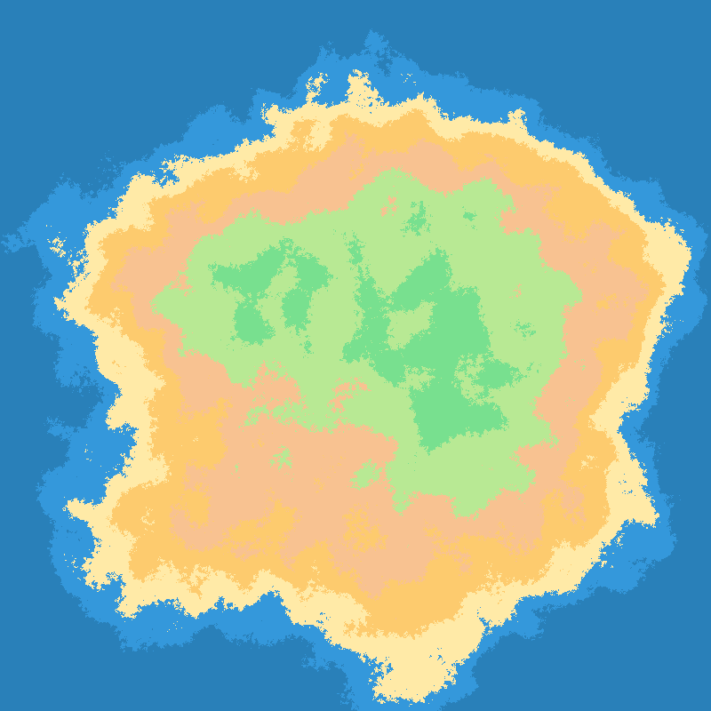

<p align="center">

<br>


<a href="https://pkg.go.dev/github.com/kelindar/simplex"></a>
<a href="https://goreportcard.com/report/github.com/kelindar/simplex"></a>
<a href="https://opensource.org/licenses/MIT"></a>
<a href="https://coveralls.io/github/kelindar/simplex"></a>
</p>

## Simplex Noise

This respository contains an experimental implementation of [simplex noise](https://weber.itn.liu.se/~stegu/simplexnoise/simplexnoise.pdf) based on the code from the public domain, found at [weber.itn.liu.se/~stegu/simplexnoise](https://weber.itn.liu.se/~stegu/simplexnoise/SimplexNoise.java). Note that this is not the genuine implementation of [Ken Perlin's simplex noise](https://mrl.cs.nyu.edu/~perlin/noise/) presented at SIGGRAPH 2002.

<p align="center">

</p>

## Benchmarks

```
cpu: Intel(R) Core(TM) i7-9700K CPU @ 3.60GHz
BenchmarkNoise/10x10-8       763042   1568 ns/op      0 B/op   0 allocs/op
BenchmarkNoise/100x100-8     7402     159403 ns/op    0 B/op   0 allocs/op
BenchmarkNoise/1000x1000-8   74       15732020 ns/op  0 B/op   0 allocs/op
```

## Contributing

We are open to contributions, feel free to submit a pull request and we'll review it as quickly as we can. This library is maintained by [Roman Atachiants](https://www.linkedin.com/in/atachiants/)

## License

Tile is licensed under the [MIT License](LICENSE.md).
